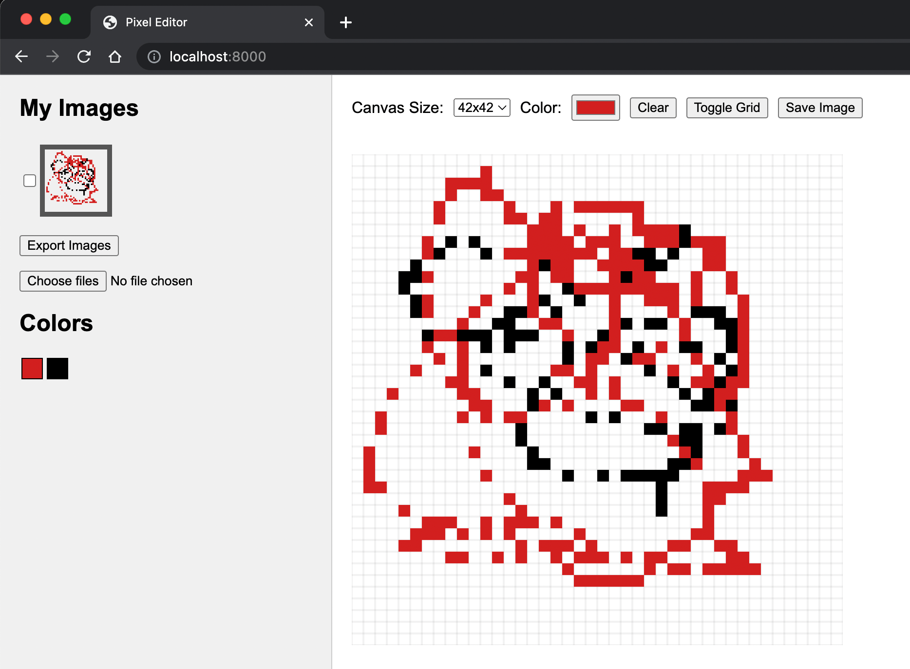
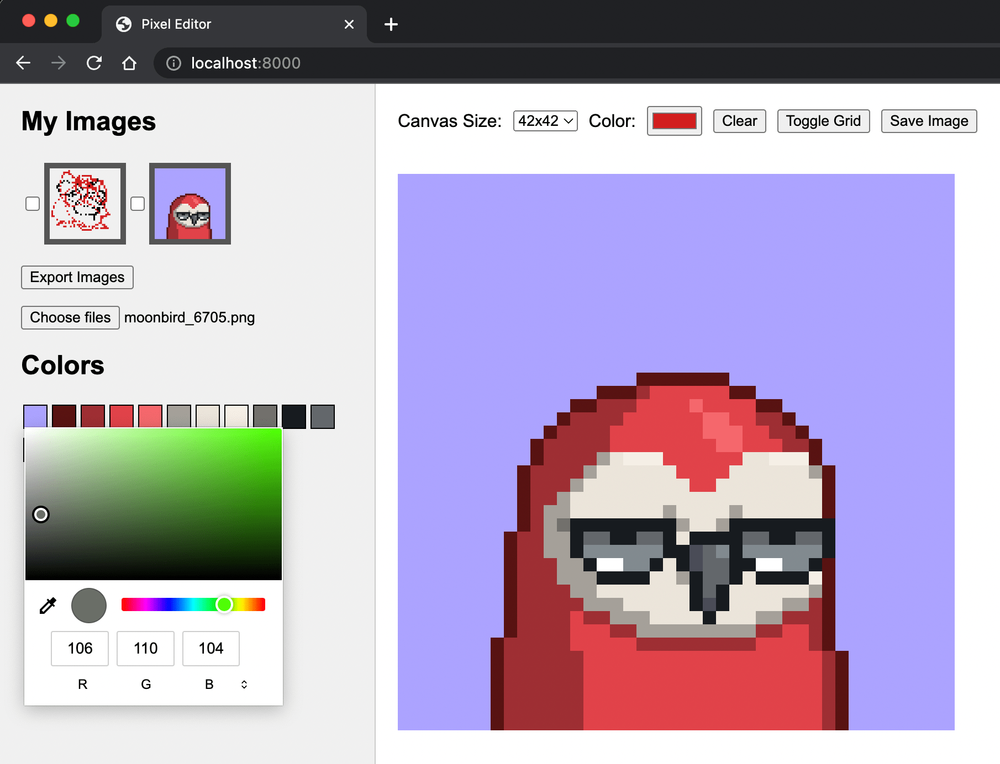

# Pixel Editor

Pixel Editor is a simple web application that allows users to create pixel art, save their creations as assets, and import or export assets as images. Users can easily draw on a grid canvas, pick colors, and toggle the visibility of the grid.


<div style="display:block;margin:auto;height:80%;width:60%">
  
</div>

<div style="display:block;margin:auto;height:80%;width:60%">
  
</div>

## Features

- Draw on a grid canvas with customizable sizes
- Color picker to select custom colors
- Toggle grid visibility
- Save canvas as an asset
- Load saved assets to edit or continue drawing
- Import and export assets as images
- Visualize all unique colors of an image
- Modify the colors of an image

## How to Run

### Method 1: Using Python

If you have Python installed on your computer, you can use the built-in HTTP server to run the app. Navigate to the project directory in your terminal and run the following command:

- For Python 3.x:

```
python -m http.server
```

- For Python 2.x:

```
python -m SimpleHTTPServer
```

After running the command, open your browser and navigate to `http://localhost:8000`.

### Method 2: Using an Online Editor

You can also use an online editor like [Replit](https://replit.com/) or [CodeSandbox](https://codesandbox.io/) to run the project. Simply create a new project and upload your project files, then click "Run" to start the app.

### Method 3: Opening the HTML File

Alternatively, you can open the `index.html` file directly in your web browser. However, some features like importing or exporting assets might not work as expected due to browser security restrictions when running local files. Using a local server (like in Method 1) is recommended for the best experience.